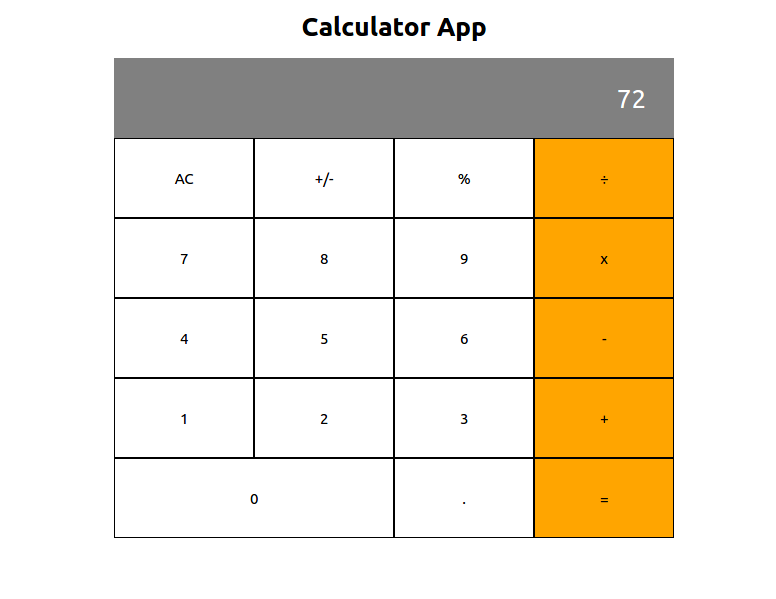

# React Calculator App

This calculator project was bootstrapped with [Create React App](https://github.com/facebook/create-react-app).

## Screenshoot of Calculator



## Tools use

    Node.js
    React
    React-DOM
    React-Create-App
    npm
    CSS
    ES6

### `Live Site on Heroku`

- Open [HEROKU](https://myreact-calculator.herokuapp.com/) to view it in the browser.

## Getting Started

These instructions will get you a copy of the project up and running on your local machine for development and testing purposes. See deployment for notes on how to deploy the project on a live system.

### Prerequisites

This project is built with JavaScript and it depends on [Node.js & NPM](https://docs.npmjs.com/downloading-and-installing-node-js-and-npm) so you will need to make sure it is installed.
To verify you have successfully installed them run `node -v` to make sure node is installed. Example

```
$ node -v
v8.16.2
```
Run `npm -v` to verify npm is installed successfully.

```
$ npm -v
6.4.1
```
## Available Scripts

In the project directory, you can run:

### `npm start`

Runs the app in the development mode.<br />
Open [http://localhost:3000](http://localhost:3000) to view it in the browser.

The page will reload if you make edits.<br />
You will also see any lint errors in the console.

### `npm test`

Launches the test runner in the interactive watch mode.<br />
See the section about [running tests](https://facebook.github.io/create-react-app/docs/running-tests) for more information.

### `npm run build`

Builds the app for production to the `build` folder.<br />
It correctly bundles React in production mode and optimizes the build for the best performance.

The build is minified and the filenames include the hashes.<br />
Your app is ready to be deployed!

See the section about [deployment](https://facebook.github.io/create-react-app/docs/deployment) for more information.

## Deployment

### Deploy on Heroku

You can deploy the project on [Heroku](https://www.heroku.com/) using the following steps:

    1. Create a Heroku Account
    2. On the terminal, run `heroku create` to create a new app
    3. Run `heroku push` to start a deployment on Heroku.
    4. Visit your project URL as assigned by Heroku to see a live deployment.


## Authors

* **Terver Aosu** - [truetechcode](https://github.com/truetechcode)
